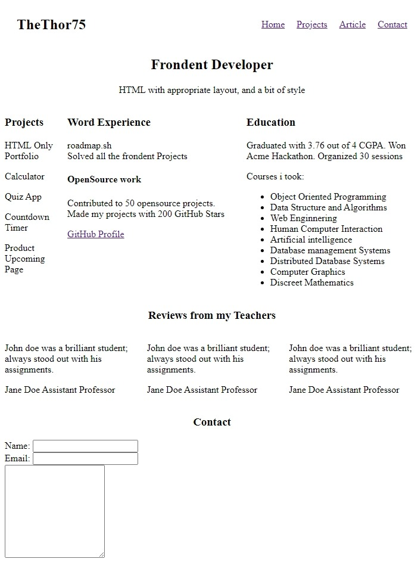

# Mes Projets

## Listes des projets

[Singe page CV](https://roadmap.sh/projects/single-page-cv); [Basic HTML Website](https://roadmap.sh/projects/basic-html-website);[Personal Portfolio](https://roadmap.sh/projects/portfolio-website)

---

Cliquez sur une image pour accéder au projet correspondant.

